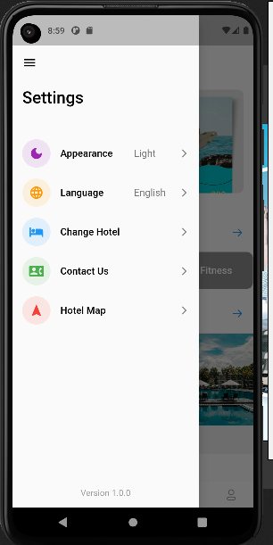
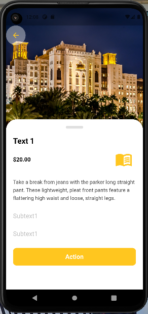

# Flutter E-commerce App Example With GetX

## Development Setup
Clone the repository and run the following commands:
```
flutter pub get
flutter pub run build_runner build --delete-conflicting-outputs
flutter run
```

## Screenshots

iamges |  iamges |
|---|---|
|  |  |
|  |  |
|  |  |
|  |  |
|  | |

